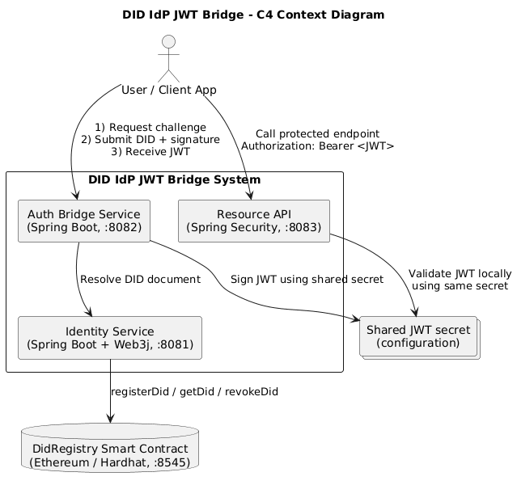

# Decentralized Identity Provider (DID IdP) + JWT Bridge

A system that uses a private blockchain as the root of trust for decentralized identities (DID), while standard services continue using familiar JWT tokens.

## Architecture



Full diagram: [docs/architecture.md](docs/architecture.md)

## Tech Stack

| Layer      | Technology                           |
|------------|--------------------------------------|
| Backend    | Java 25, Spring Boot 4.0.6, Spring WebFlux |
| Security   | Spring Security, JJWT 0.12.6, Web3j (ECDSA) |
| Blockchain | Hardhat, Solidity 0.8.24, Ganache    |
| Frontend   | Angular                              |
| Deploy     | Docker Compose                       |

## Quick Start

### Prerequisites
- Java 25+, Maven 3.9+
- Node.js 20+
- Docker & Docker Compose

### 1. Start blockchain
```bash
cd blockchain && npm install && npm run node
# In another terminal:
npm run deploy:local   # prints DID_REGISTRY_ADDRESS
```

### 2. Configure environment
```bash
cp deploy/.env.example deploy/.env
# Set DID_REGISTRY_ADDRESS from previous step
```

### 3. Run backend services
```bash
cd backend
mvn -pl identity-service -am spring-boot:run &
mvn -pl auth-bridge-service -am spring-boot:run &
mvn -pl resource-api -am spring-boot:run &
```

### 4. Run frontend (Angular DID UI)
```bash
cd frontend/did-ui
npm install
npm start
```

### Alternative: run full stack with Docker Compose
```bash
cp deploy/.env.example deploy/.env
cd deploy
# Start blockchain first (no contract address required yet)
docker compose -f docker-compose.bootstrap.yml up -d blockchain
```

Deploy `DidRegistry` to the running local chain and copy values into `deploy/.env`:
```bash
cd ../blockchain
npm install
npm run deploy:local
# Use Ganache funded private key from docker logs:
# cd ../deploy && docker compose -f docker-compose.bootstrap.yml logs blockchain
# Set DID_REGISTRY_ADDRESS and BLOCKCHAIN_ACCOUNT_PRIVATE_KEY in deploy/.env
```

Start the full stack:
```bash
cd ../deploy
# Keep the bootstrap Ganache instance running and start the rest of services.
docker compose up --build -d identity-service auth-bridge-service resource-api frontend
```

Health verification:
```bash
docker compose ps
curl http://localhost:8081/actuator/health
curl http://localhost:8082/actuator/health
curl http://localhost:8083/actuator/health
curl -I http://localhost:8080
```

Stop:
```bash
docker compose down
```

### Alternative: run full stack with Kubernetes (local/dev cluster)
1. Build local images (or replace image names in manifests with your registry images):
```bash
docker build -t did-identity-service:local -f backend/identity-service/Dockerfile backend
docker build -t did-auth-bridge-service:local -f backend/auth-bridge-service/Dockerfile backend
docker build -t did-resource-api:local -f backend/resource-api/Dockerfile backend
docker build -t did-frontend:local -f frontend/did-ui/Dockerfile frontend/did-ui
```
> If your cluster nodes cannot see local Docker images (for example, kind or remote Docker daemon), load/push these images into the cluster runtime/registry before applying manifests.

2. Prepare secrets and base resources:
```bash
export JWT_SECRET='replace-with-32-plus-char-secret'
export IDENTITY_KEY_ROTATION_TOKEN='replace-with-key-rotation-token'
export BLOCKCHAIN_ACCOUNT_PRIVATE_KEY='0xreplace-with-funded-private-key'
export GANACHE_MNEMONIC='replace-with-local-dev-ganache-mnemonic'
kubectl apply -f deploy/kubernetes/namespace.yaml
kubectl -n did-idp create secret generic did-idp-secrets \
  --from-literal=JWT_SECRET="$JWT_SECRET" \
  --from-literal=IDENTITY_KEY_ROTATION_TOKEN="$IDENTITY_KEY_ROTATION_TOKEN" \
  --from-literal=DID_REGISTRY_ADDRESS='0x0000000000000000000000000000000000000000' \
  --from-literal=BLOCKCHAIN_ACCOUNT_PRIVATE_KEY="$BLOCKCHAIN_ACCOUNT_PRIVATE_KEY" \
  --from-literal=GANACHE_MNEMONIC="$GANACHE_MNEMONIC" \
  --dry-run=client -o yaml | kubectl apply -f -
kubectl apply -f deploy/kubernetes/configmap.yaml
kubectl apply -f deploy/kubernetes/blockchain.yaml
```
3. Deploy `DidRegistry` into the in-cluster blockchain and update `DID_REGISTRY_ADDRESS`:
```bash
kubectl -n did-idp port-forward svc/blockchain 8545:8545
# In another terminal:
cd blockchain
npm install
npm run deploy:local
# Then re-apply secret with real DID_REGISTRY_ADDRESS:
kubectl -n did-idp create secret generic did-idp-secrets \
  --from-literal=JWT_SECRET="$JWT_SECRET" \
  --from-literal=IDENTITY_KEY_ROTATION_TOKEN="$IDENTITY_KEY_ROTATION_TOKEN" \
  --from-literal=DID_REGISTRY_ADDRESS='<address-from-deploy:local>' \
  --from-literal=BLOCKCHAIN_ACCOUNT_PRIVATE_KEY="$BLOCKCHAIN_ACCOUNT_PRIVATE_KEY" \
  --from-literal=GANACHE_MNEMONIC="$GANACHE_MNEMONIC" \
  --dry-run=client -o yaml | kubectl apply -f -
```
4. Start backend + frontend:
```bash
kubectl apply -k deploy/kubernetes
kubectl -n did-idp rollout status deploy/identity-service
kubectl -n did-idp rollout status deploy/auth-bridge-service
kubectl -n did-idp rollout status deploy/resource-api
kubectl -n did-idp rollout status deploy/frontend
```
5. Access UI/API:
```bash
kubectl -n did-idp port-forward svc/frontend 8080:80
# UI: http://localhost:8080
```

### Auth flow (curl)
```bash
# Register DID
curl -X POST http://localhost:8081/did/register \
  -H "Content-Type: application/json" \
  -d '{"did":"did:example:alice","publicKey":"0x04..."}'

# Get challenge
curl http://localhost:8082/auth/challenge

# Get JWT
curl -X POST http://localhost:8082/auth/token \
  -H "Content-Type: application/json" \
  -d '{"did":"did:example:alice","challenge":"<challenge-from-/auth/challenge>","signature":"0x..."}'

# Refresh JWT
curl -X POST http://localhost:8082/auth/refresh \
  -H "Content-Type: application/json" \
  -d '{"refreshToken":"<refresh-token-from-/auth/token>"}'

# Rotate DID public key
curl -X PUT http://localhost:8081/did/did:example:alice/key \
  -H "X-Key-Rotation-Token: <identity-key-rotation-token>" \
  -H "Content-Type: application/json" \
  -d '{"publicKey":"0x04...new"}'

# Call protected API
curl http://localhost:8083/api/me -H "Authorization: Bearer <jwt>"
```

> `auth-bridge-service` keeps active challenges in-memory. In multi-instance deployments, configure sticky routing for `/auth/challenge` and `/auth/token` to the same instance (or use a shared challenge store).

## Roadmap

See [ROADMAP.md](ROADMAP.md).

## License

MIT
