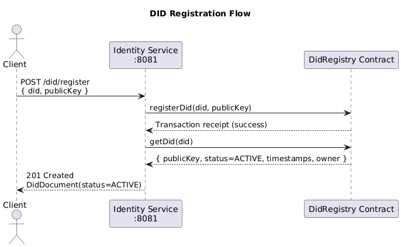
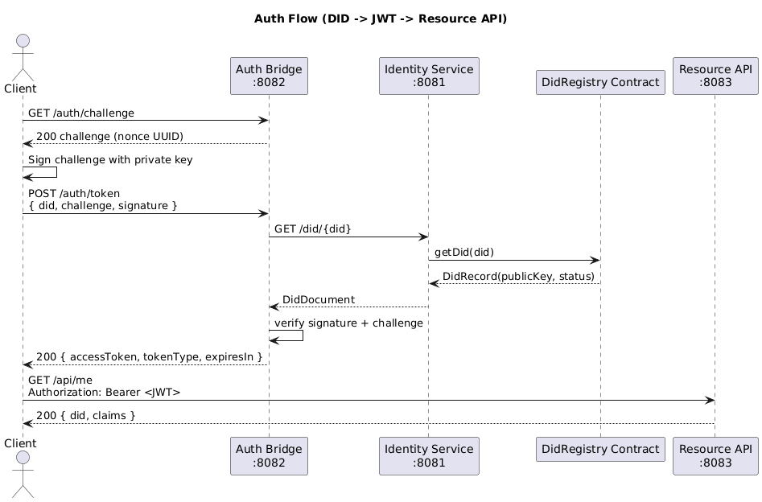

# Architecture

Diagrams are stored in `docs/diagrams/` as PlantUML source and exported PNG files.

## C4 Context

Source: `docs/diagrams/c4-context.puml`

## Sequence: DID registration flow

Source: `docs/diagrams/sequence-did-registration.puml`

## Sequence: Auth flow (DID -> JWT -> Resource API)

Source: `docs/diagrams/sequence-auth-jwt-resource.puml`
